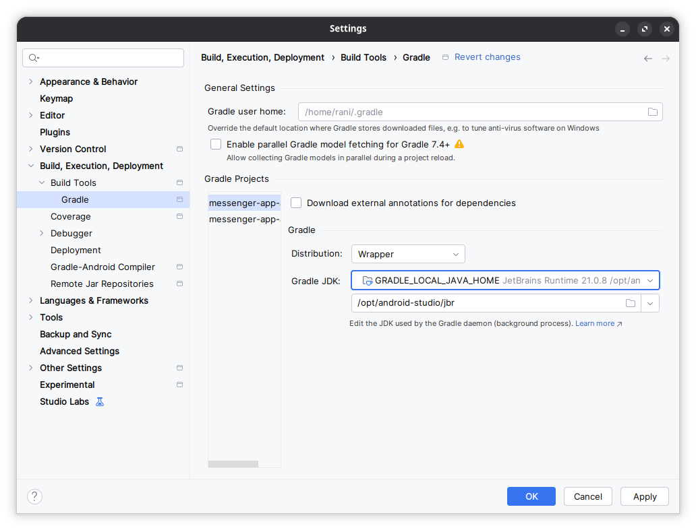

## 要求

- **聊天器**

  - 工程环境: Android 开发工程环境
  - 聊天器: 消息列表页，未读消息，聊天界面(输入框，表情框，消息列表，时间戳)
  - 数据存储: 数据库设计
- **加分项举例(自由发挥)**

  - 基于 Java 最原始的 API 或者是 j2ee 框架，实现一套局域网内的简易的聊天服务器
  - 设计聊天消息协议，联系人，消息历史等数据关系设计，支持协议扩展
- **交付产物**

  - 仓库及代码
  - 设计思路文档，代码结构，设计思路
  - 后期优化思路

---

## 环境

- 主机：arch Linux （内核版本 6.12.58-1-lts）
- 

## 其他问题与设置

### 修改 JDK 版本

> 参考： https://juejin.cn/post/7451502116018044947

在 Android Studio 的新版本中， `Project Structure` 中的 JDK 设置已经移除，取而代之的是通过 `Settings` 中的 Gradle 配置进行设置。具体步骤如下：

1. 打开 Android Studio。
2. 进入 `File` -> `Settings` （Windows）或 `Android Studio` -> `Preferences` （Mac）。
3. 在设置界面中，选择 `Build, Execution, Deployment` -> `Build Tools` -> `Gradle` 。
4. 在 `Gradle` 设置页面，找到 `Gradle JDK` 选项。
5. 点击下拉框，选择想要使用的 JDK 路径。如果希望指定一个特定版本，可以选择 `Add JDK` 来手动添加一个 JDK 路径。

在 Linux/macOS 终端（如 Bash、Zsh，Arch Linux 默认常用 Zsh）中，删除整个单词的快捷键分 **删除光标前的单词** 和 **删除光标后的单词** 两种场景，以下是最常用的快捷键（无需额外配置，默认生效）：

### 一、核心快捷键（必记）
| 操作场景                     | 快捷键（Bash/Zsh 通用） | 说明                                              |
| ---------------------------- | ----------------------- | ------------------------------------------------- |
| 删除光标 **前面** 的整个单词 | `Ctrl + W`              | 从光标位置向左删除到单词开头（以空格/符号为分隔） |
| 删除光标 **后面** 的整个单词 | `Alt + D`               | 从光标位置向右删除到单词结尾（以空格/符号为分隔） |

### 三、扩展快捷键（终端文本编辑常用）
搭配这些快捷键效率更高，同样默认生效：
| 操作                         | 快捷键     |
| ---------------------------- | ---------- |
| 删除光标前所有内容（到行首） | `Ctrl + U` |
| 删除光标后所有内容（到行尾） | `Ctrl + K` |
| 光标移动到行首               | `Ctrl + A` |
| 光标移动到行尾               | `Ctrl + E` |
| 光标向右移动一个单词         | `Alt + →`  |
| 光标向左移动一个单词         | `Alt + ←`  |
